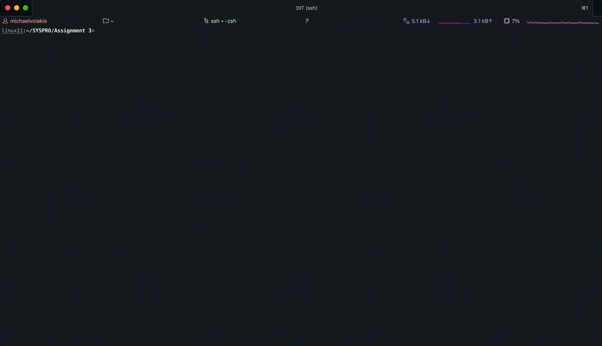

## :syringe: Vaccine Monitor CLI 

## A simple Command Line Tool that implements monitor processes tracking and transfering vacccination data by using POSIX threads and UNIX sockets.

 </img>


#### :building_construction: Compilation

In order to provide easier compilation a Makefile has been included. Since the Project deals with multiple processes (client-server model) the Makefile creates 2 executables : travelMonitorClient and  MonitorServer.


#### :runner: Execution and Required Arguments

```bash
./travelMonitorClient [args]

ARGS: 
-m :  number of monitors to be created
-b :  socket buffer size
-c :  cyclic buffer size
-s :  bloom filter size
-i :  path to the directory that contains the country subdirectories with vaccination records
-t : number of threads of each monitorServer

```

> Note that the arguments need to be provided in the order listed above. In case the user provides a different number of arguments the program will show an error message an terminate.
>*Execution requires for the **directory logs/** to have been previously created. If there is no such directory the program will terminate.

#### General Approach

> Communication between the client and the server is handled by 1 socket (both read & write)

The program is divided into 4 distinct types of classes:

- **Entities**
    Entities are all the classes that represent unique identities such as Persons,Viruses,Countries etc. Each entity is contained into its own directory and consists of a list implementation where each node stores a pointer to the individual object. Most of the classes have been implemented in the same way as the 1st & 2nd Project without any additional changes.
    > **The classes Monitor and TravelMonitor provide all the functionality necessary for the TravelMonitor Client and the MonitorServer**
- **Data Structures**
    Data Structures are all the classes that do not represent a unique identity (in the same way as Persons or Viruses ) but are required for storing all the necessary info about the entities listed above. For Example simple Data Structures such as Date and more Complex ones such as the BloomFilter and SkipList. The Bloom Filter and Skip List have been implemented in the same way as the 2nd Project. The Requests class (same as 2nd Project) deals with the travel requests that are entered by the user as a command.
- **Utilities**
    Utilities are all the classes that do not fit in any of the categories listed above.
    They are contained into the Utils directory and implement numerous functions (for example calculating dates) that are required by other classes. The command parser has been moved in the monitorUtils file.
    > The Utils.cpp file deals with argument(s) checking,directory parsing ,error printing.
    > **To prevent code repetition additional helper functions such as geting strings/integers from the client/server using sockets have been implemented to transfer info between the sockets.**


### TravelMonitorClient
The travelMonitorClient.cpp file implements the travelMonitor as a web client by taking advantage of the travelMonitor Object. The communication between the travelMonitor and each of the Monitor Servers is synchronous, meaning that it must wait for the specific monitor to send all the necessary info (Bloom Filters) in order to proceed to the next one. When the travelMonitor finishes reading the BloomFilters from all ther servers it asks for user input in order to process any of the 5 available commands.

### MonitorServer

The MonitorProcess.cpp file implements the Monitor as a web server by taking advantage of the Monitor Object. Each server gets all the information it needs (including the paths to process) as arguments. After creating the Monitor Object it implements the server in the following way:
1. Initializes all the necessary server structs(sockaddr,hostent).
2. Converts all the paths into a string array and creates a pathBuffer Object.
3. Creates the required number of threads where each one executes the threadExecuter function (see Utils).
4. Fills the buffer as soon as it is not full.
5. Binds the socket to the local hostname address and listens for (1 only) any available connection from the client.
6. Creates the Bloom Set and Sends it back to the client.
7. Hangs the execution waiting for any command to be sent from the client.
8. Creates the logs , joins the threads, closes the sockets and exits (only by having read the /exit command).


### BloomFilter Transfers

Since there is a limit (socket buffer size ) to the bytes that can be transferred through a socket the BloomFilters are transfered in the following way:
1. There are bloomSize / socketBufferSize  iterations where in each loop a maximnum of bufferSize / sizeof(int) integers are being transfered.
2. **To synchronize reads/writes through the socket the message "Done" is sent from the read side each time an integer is sent while the write side wait for this message in order to continue sending.**
3. When the previous loop has finished, in case there are any remnant last bytes that haven't been transferred due to the limitation of the socket buffer size(bloomSize / socketBufferSize has a remainder)  a last loop of transferSize /sizeof(int) iterations transfers the last integer of the bloom filter.
4. **To synchronize the client and server after all bloom filters have been sent, the client sends the "All Blooms Transferred" message notifying the server that it can wait for commands.**

--- 

### Additional Info

- The Ports used for the servers begin from **7777** and are incremented by one depending on the monitorID.
- The terminateMainThread() function is used only from the main thread of the server to determine if all the paths are processed from the other threads. **When the processing of the initial paths(from arguments) is done the other threads hang in case the user adds any additional files using the /addVaccinationRecords command.**
- **The threads only terminate when the terminateAllThreads() function is called** setting the finished variable to true.
- **In case the program hangs while trying to connect try exiting and rerunning it.**
- **There are a few cases where the vaccinatinon information might be inaccurate (for example the monitor detecting that a person hasn't been vaccinated while it actually is vaccinated)**
- **If the bloom filter doesn't detect a vaccination try setting a larger socketBufferSize.**